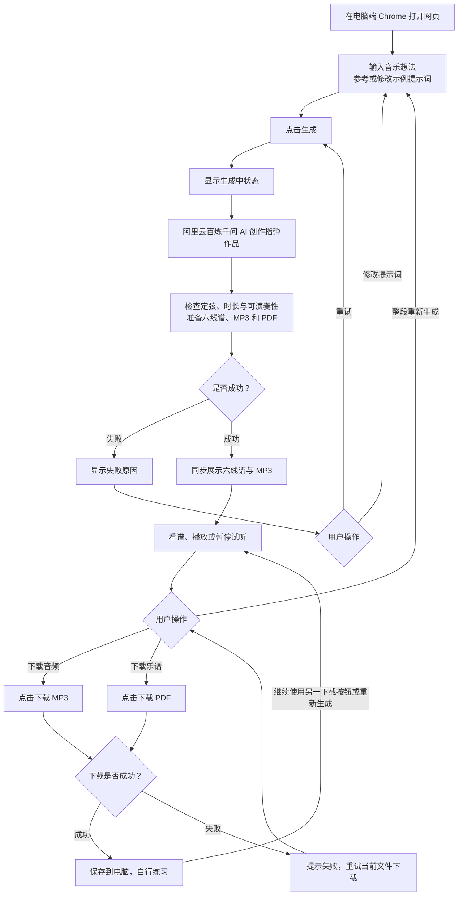

# 音乐伙伴（Music Companion）三天原型产品说明

更新日期：2026-10-09

本文合并最新的需求文档、功能清单和功能流程图，作为三天本地原型的统一产品范围说明。未确定事项单独列出，不把早期完整版的功能自动纳入本次开发。

## 1. 产品定位与目标

一款通过 AI 理解提示词并参与音乐创作，帮助吉他指弹学习者生成喜欢的短作品、看六线谱、试听并下载的网页原型。

本次重点验证：用户是否喜欢生成的作品，以及是否愿意拿起吉他练习。生成次数与网页停留时间不能单独证明这一目标成立；是否提高长期练习持续性与学习效率，需要后续验证。

## 2. 目标用户与使用环境

- 主要用户：希望创作并练习自己喜欢的小作品的吉他指弹学习者，不限定年龄。
- 次要用户：吉他教学者，可使用相同页面生成素材并在线下判断是否适合教学，不提供独立教师流程。
- 首次演示环境：本地运行、电脑端 Chrome 浏览器。
- 无需注册、登录或完成水平测评即可开始创作。
- 安卓打包属于后续方向，不纳入三天原型交付。

## 3. 已确定的作品范围

- 乐器：仅吉他。
- 作品形式：简单和声加旋律的指弹作品，不能仅用单音旋律代替。
- 定弦：标准定弦，从六弦至一弦为 E2、A2、D3、G3、B3、E4。
- 技巧边界：不支持打板等打击类指弹技巧及非标准定弦。
- 时长：按演奏时长控制，不超过 1 分钟（60 秒），不要求每首都达到 1 分钟。
- 速度与调性：每个作品内部保持统一。
- 主要难度指标：音符密度，即音符数量 ÷ 演奏时长，单位为音符/秒；越低越简单，越高越难。
- 可演奏性：保留同弦冲突、弦位、品位、跨度与换把等基本检查，低密度不等于一定能弹。

音符密度分级阈值与计数口径尚未确定，不能自行设置难度等级或宣称适用于所有演奏水平。

## 4. 核心功能清单

### F1. 文字创作输入

- 提供音乐想法输入框，用户可自由编辑文字。
- 提供少量示例提示词，帮助用户开始描述；具体示例须与实际支持的生成范围一致。
- 不做多轮引导问答，不将账号或测评设为创作前置条件。

### F2. 真实 AI 创作与作品检查

- 使用阿里云百炼千问，由真实模型参与音乐内容创作；具体模型型号待确认。
- 生成内容遵守第 3 节的作品范围，并进行基本可演奏性检查。
- 规则与模板可辅助和约束创作，不能替代 AI，不能只识别关键词再随机返回模板作品。
- 模型调用失败或作品检查不合格时，明确提示失败，不用纯模板结果冒充 AI 生成。

### F3. 六线谱展示

- 展示当前作品的吉他六线谱，包含弦号、品位与节奏信息。
- 网页乐谱、音频与下载文件对应同一份音乐数据和同一作品版本。
- 不做跟谱高亮、选段、局部生成或直接编辑音符。

### F4. 音频试听

- 支持播放与暂停。
- 试听直接使用最终生成的 MP3，与下载音频一致。
- 如使用合成音色，须如实说明，不要求真人录制音频。
- 不做变速播放或循环选段。

### F5. 整段重新生成

- 用户可修改提示词，再生成整段作品。
- 新作品继续遵守形式、定弦、时长与可演奏性范围。
- 新结果完成后同步更新谱面、音频和下载对象，不混用新旧版本。
- 不做按小节选择和局部重新生成。
- 不同生成结果之间是否保持原曲速度、调性或主题，尚未决定；不能把局部生成的旧约束自动套用到整段生成。

### F6. 文件下载

- 提供独立的“下载 MP3”和“下载 PDF”两个按钮，可分别或先后使用。
- MP3 为当前作品音频，PDF 为当前作品六线谱。
- 文件必须与当前展示和试听的作品一致，可正常播放或查看，谱面清楚可读。
- 不做 ZIP 打包、云端作品库、浏览器本地作品库或跨设备同步。
- 下载位置由浏览器和用户设置决定，应清楚说明下载内容。

### F7. 处理状态与错误提示

- 显示生成中状态，成功后展示完整作品结果。
- 音频与 PDF 等结果准备好后才视为生成成功，失败或半成品不能冒充成功。
- 生成失败时给出清楚提示，并允许重试或修改提示词。
- 下载失败时明确提示，允许重新下载当前作品，无需重新调用 AI。

## 5. 核心使用场景与功能流程图

学习者打开网页，输入自己喜欢的音乐听感，生成作品后看谱、试听。若不满意，修改提示词并重新生成；满意后分别下载 MP3 与 PDF，自行练习。

教学者使用同一流程获取素材，学习目标和教学适配在线下判断。本次不在软件中管理学生、布置作业或跟踪练习。

图中的分支表示可选操作，不要求下载某个文件之后才能使用另一个按钮，也不要求先下载才可重新生成。

## 6. 这一版先不做

- 哼唱输入与旋律识别。
- 多轮创作引导问答。
- 按小节局部生成、直接编辑音符与专业编曲编辑。
- 社区分享、点赞、评论和站外发布。
- 账号、云端或浏览器本地作品库、历史版本与跨设备同步。
- 专业水平定位、详细水平匹配和教师填写学生水平流程。
- 自动演奏评价、练习进度、每日练习计划和自动学习目标推荐。
- 独立教师页面、学生管理、作业布置及教师查看学生进度。
- 吉他之外的乐器、多乐器合奏教学及虚拟角色聊天。
- 打板类技巧、非标准定弦，以及尚未确认的其他吉他演奏形式功能。
- 独立伴奏文件、ZIP 打包下载。
- 独立手机或桌面应用及安卓打包。

上述项目不属于三天原型验收范围。延期不代表永久删除，也不承诺后续上线日期。

## 7. 最低验收条件

1. 在电脑端 Chrome 打开本地网页，无需登录或测评，能输入提示词并发起生成。
2. 生成由真实千问模型参与，不能用固定示例或纯模板结果作为 AI 创作验收。
3. 作品为标准定弦的简单和声加旋律，演奏时长不超过 60 秒，不含打板类技巧。
4. 六线谱清楚可读，包含弦号、品位和节奏；音频可播放、暂停，与谱面一致。
5. 代表作品通过基本演奏约束检查，并由具备指弹能力的人试奏或审阅。
6. 修改提示词后能整段重新生成，页面不会出现新谱配旧音频。
7. 点击“下载 MP3”和“下载 PDF”，可分别获得当前作品的正确文件，下载后能正常播放或查看。
8. 生成与下载失败时明确提示，支持相应重试，不显示虚假的成功结果。
9. 核心流程无需依赖延期功能即可完成。

## 8. 三天开发建议顺序

- 第一天：验证同一份指弹音乐数据能输出六线谱、MP3 与 PDF，并尽早验证真实模型接口和结构化音乐候选。
- 第二天：接入提示词到 AI 创作的流程，完成指弹检查、时长控制及结果展示。
- 第三天：完成整段重新生成、两个下载按钮、处理状态和失败提示，在 Chrome 中试用。

上述顺序为开发建议，尚未验证工期。样例用于技术验证，不能冒充用户实时 AI 生成结果；遇到音乐或导出链路问题，应先解决核心流程，不加回延期功能。

## 9. 待确认事项

- 千问具体型号、账号地域、接入配置与调用预算。
- 音符密度分级阈值与计数口径，尤其是同时发声、延音等情形。
- 首批可演奏指型、跨度与换把等量化检查范围。
- 整段重新生成是否保留上一作品的速度、调性或主题。
- 音频尾音、编码填充是否计入实际 MP3 文件的 60 秒限制；谱上演奏时长上限已确定。

上述项目不自行设定默认值。模型接入凭证属于本地运行配置，不放入产品文档或仓库。

## 10. 原始来源

本说明整理自以下已确认文档的最新版本：

- 《音乐伙伴三天原型需求文档.md》
- 《音乐伙伴三天原型功能清单.md》
- 《音乐伙伴三天原型功能流程图.md》

本文是产品范围汇总，不代表这些功能已经开发完成。
